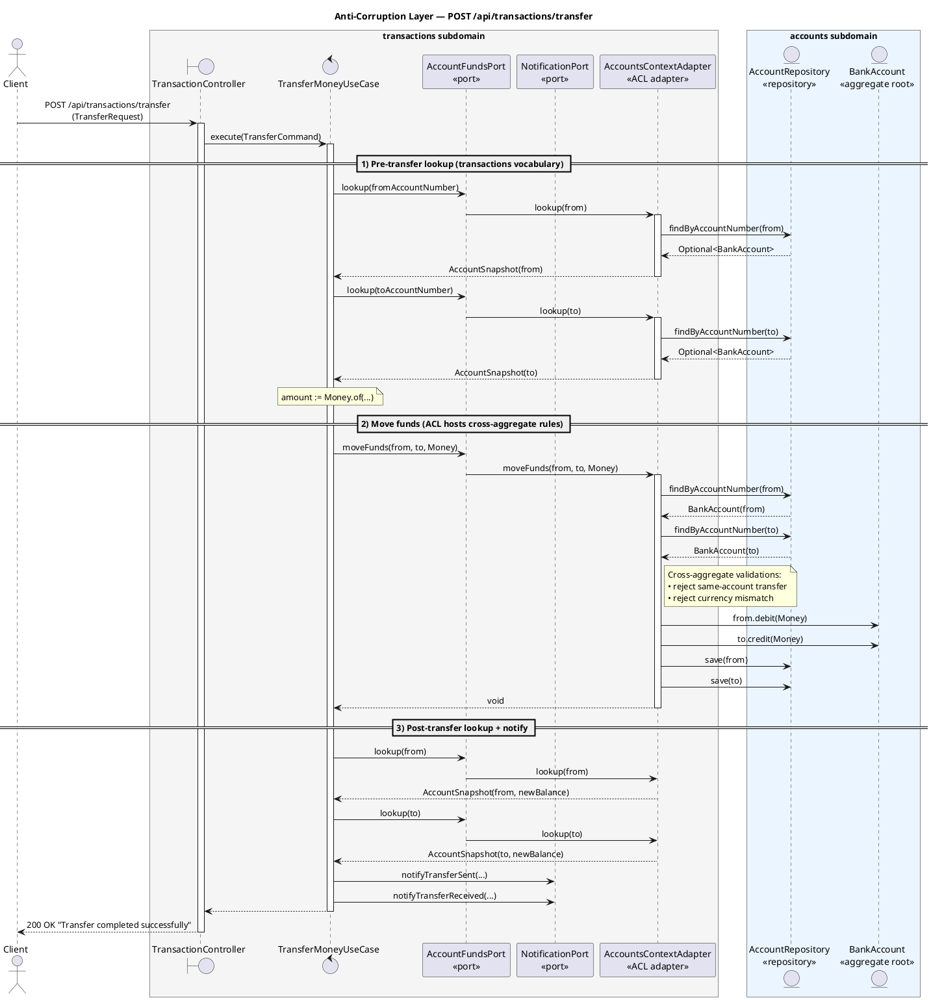

# Capa Anticorrupción (ACL)

Este documento resume cómo está implementada la **Capa Anticorrupción** entre los subdominios `transactions` y `accounts` en este proyecto.

## ¿Por qué una ACL?

`transactions` necesita los saldos y la capacidad de mover fondos, ambos viven en `accounts`. Sin una ACL, el código de transactions importaría `BankAccount`, `AccountRepository` y `AccountNotFoundException` directamente, acoplando ambos subdominios de manera que cualquier cambio en `accounts` se propagaría a `transactions`.

La ACL evita ese acoplamiento: `transactions` expresa lo que necesita **en su propio vocabulario** (un puerto + un snapshot), y un único adaptador traduce entre ese vocabulario y los tipos reales de `accounts`.

## Las piezas

| Rol                    | Tipo                                                                                       | Ubicación                                             |
| ---------------------- | ------------------------------------------------------------------------------------------ | ----------------------------------------------------- |
| Puerto (interfaz)      | `AccountFundsPort`                                                                         | `transactions/application/port/`                      |
| Snapshot (DTO de lectura) | `AccountSnapshot` (`record`)                                                            | `transactions/application/port/`                      |
| Adaptador (la ACL)     | `AccountsContextAdapter implements AccountFundsPort`                                       | `transactions/infrastructure/acl/`                    |
| Consumidor (caso de uso) | `TransferMoneyUseCase`                                                                   | `transactions/application/usecase/`                   |
| Cableado               | `accountFundsPort(...)` `@Bean`                                                            | `shared/infrastructure/config/BeanConfiguration.java` |

```
┌─────────────────────────── transactions ───────────────────────────┐
│                                                                    │
│  TransferMoneyUseCase ──► AccountFundsPort ──► AccountSnapshot     │
│                                  ▲                                 │
│                                  │ implementa                      │
│                                  │                                 │
│                  AccountsContextAdapter  (ACL, único archivo       │
│                                  │       autorizado a importar     │
│                                  │       desde accounts/)          │
└──────────────────────────────────┼─────────────────────────────────┘
                                   │ usa
                                   ▼
┌─────────────────────────── accounts ───────────────────────────────┐
│  AccountRepository · BankAccount · AccountNotFoundException        │
└────────────────────────────────────────────────────────────────────┘
```

## La regla fundamental

Dentro del subdominio `transactions`, **solo** los archivos bajo `transactions/infrastructure/acl/` están autorizados a importar desde `com.banco.accounts.*`. Una importación de `com.banco.accounts.*` en cualquier otro lugar de `transactions/` es una violación de diseño, no un asunto estilístico.

La regla inversa es más estricta: `accounts` **no** debe importar nada de `com.banco.transactions.*` en absoluto.

## Qué expone el puerto

`AccountFundsPort` está escrito en el vocabulario de *transactions*, no en el de *accounts*:

```java
public interface AccountFundsPort {
    AccountSnapshot lookup(String accountNumber);
    void moveFunds(String fromAccountNumber, String toAccountNumber, Money amount);
}
```

`AccountSnapshot` es un `record` inmutable que contiene únicamente los campos que transactions realmente necesita (`accountNumber`, `holderName`, `balance`). **No** es `BankAccount`: el agregado nunca cruza la frontera.

## Qué hace el adaptador

`AccountsContextAdapter` es el único puente. Este:

1. Resuelve los números de cuenta a agregados `BankAccount` mediante `AccountRepository`.
2. Traduce "cuenta no encontrada" desde `AccountNotFoundException` (una excepción de *accounts*) al mismo tipo de excepción relanzada en la frontera: el caso de uso nunca captura directamente un tipo específico de accounts.
3. Mapea `BankAccount` → `AccountSnapshot` antes de devolverlo al caso de uso.
4. Aloja las validaciones **entre agregados** que no pertenecen a un único agregado:
   - rechazar transferencia a la misma cuenta,
   - rechazar transferencia entre cuentas con monedas distintas.
5. Llama a `BankAccount.debit` / `credit` y persiste ambos agregados.

## Diagrama de secuencia — `POST /api/transactions/transfer`

El diagrama a continuación traza una solicitud completa de transferencia y hace explícita la frontera de la ACL.
Todo lo que está dentro del recuadro punteado es el subdominio `transactions`; todo lo que está fuera es `accounts`. Los únicos cruces ocurren dentro de `AccountsContextAdapter`.



> **Renderizado:** el fragmento anterior está en **PlantUML** (un dialecto de UML 2.x).
> En IntelliJ instala el plugin *PlantUML Integration*, o pégalo en <https://www.plantuml.com/plantuml/uml/> para visualizarlo.

Aspectos clave que el diagrama hace visibles:

- `TransferMoneyUseCase` se comunica **únicamente** con `AccountFundsPort` y `NotificationPort`. Nunca ve `BankAccount`, `AccountRepository` ni ninguna excepción de `accounts`.
- Las flechas que *realmente* cruzan desde `transactions` hacia `accounts` se originan todas dentro de `AccountsContextAdapter`: esa es la ACL.
- Las validaciones entre agregados (misma cuenta, misma moneda) se ubican en `moveFunds`, no en el caso de uso ni en `BankAccount`.
- Las llamadas a `lookup` posteriores a la transferencia (paso 3) son la forma en que el caso de uso obtiene los saldos actualizados para la notificación sin tocar nunca el agregado directamente.

## Cómo se mantiene limpio el caso de uso

`TransferMoneyUseCase` depende únicamente de `AccountFundsPort` y `NotificationPort`: no sabe nada sobre `BankAccount`, `AccountRepository`, JPA o H2. El flujo de transferencia es:

```
lookup(from)  →  lookup(to)  →  moveFunds(from, to, amount)
              →  lookup(from)  →  lookup(to)  →  notify
```

El `lookup` repetido después de `moveFunds` es la forma en que el caso de uso obtiene los saldos posteriores a la transferencia sin tocar nunca el agregado.

## Cableado

Los casos de uso no se descubren automáticamente con `@Service`; se registran manualmente para que la capa de aplicación se mantenga libre de framework. En `BeanConfiguration`:

```java
@Bean
public AccountFundsPort accountFundsPort(AccountRepository accountRepository) {
    return new AccountsContextAdapter(accountRepository);
}

@Bean
public TransferMoneyUseCase transferMoneyUseCase(
        AccountFundsPort accountFundsPort,
        NotificationPort notificationPort) {
    return new TransferMoneyUseCase(accountFundsPort, notificationPort);
}
```

Nótese que `transferMoneyUseCase` recibe el **puerto**, no `AccountRepository`: Spring inyectaría cualquiera de los dos sin problema, pero inyectar el puerto es lo que hace cumplir la regla arquitectónica a nivel del cableado.

## Pruebas a través de la frontera

Dado que el caso de uso depende de una interfaz, las pruebas sustituyen el puerto con un fake en memoria hecho a mano en lugar de Mockito (ver `TransferMoneyUseCaseTest`). La prueba ejercita la lógica de orquestación del caso de uso sin arrancar Spring, JPA o el propio adaptador ACL.

## Cómo extender la ACL

Cuando una nueva funcionalidad de transactions necesite más datos o comportamiento de accounts, **no** agregues una importación; en su lugar:

1. Agrega el método a `AccountFundsPort` en el vocabulario de transactions.
2. Agrega los nuevos campos a `AccountSnapshot` (o introduce un nuevo record de snapshot), siempre en términos de transactions.
3. Implementa el nuevo método en `AccountsContextAdapter`, realizando la traducción allí.
4. Deja que el caso de uso siga comunicándose con el puerto.

Si más adelante accounts renombra `BankAccount`, divide el agregado o cambia su estrategia de persistencia, **solo `AccountsContextAdapter` debería necesitar cambios**. Ese es todo el propósito de la ACL.